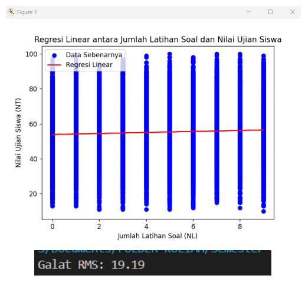
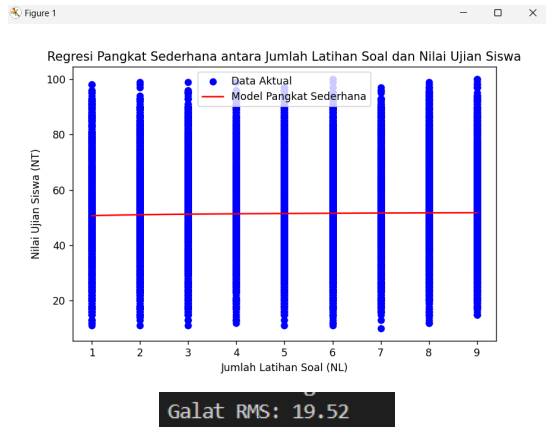

# Tugas Implementasi Regresi
## Deskripsi
Merupakan implementasi kode untuk permasalahan Regresi yang dibuat dengan bahasa Python. Berisikan 2 metode penyelesaian yaitu:
- Regresi Linear
- Regresi Pangkat Sederhana   

 

## Dataset
file Student_Performance.csv  
## Hasil
- Regresi Linear  

- Regresi Pangkat Sederhana  

